# User Management Service

## Table of Contents
1. [About the Project](#about-the-project)
2. [Technologies](#technologies)
3. [Installation](#installation)
   - [Option 1: IntelliJ Local Development](#option-1-intellij-local-development)
   - [Option 2: Full Docker Setup](#option-2-full-docker-setup)
4. [API Documentation](#api-documentation)
5. [Architecture & Design Decisions](#architecture--design-decisions)
6. [Testing](#testing)
7. [Production Deployment](#production-deployment)

---

## About the Project

This project is a **user management system** that incorporates the fundamentals of modern microservice architecture. It performs user registration, update, deletion, and query operations in a secure, scalable, and maintainable way. The system is designed with clean architecture principles, using layered separation of concerns, event-driven communication capabilities, and production-ready error handling patterns.

### Live Demo
The application is deployed and accessible at:
**https://user-management-service-task-1.onrender.com/api/user**

### What Can You Do?

#### 1. User Creation
- Creating new users with personal information
- Each user gets a unique **UUID** identifier
- Email addresses must be unique
- Phone numbers must be unique
- Passwords are automatically hashed with **BCrypt**
- Default role `ROLE_USER` is assigned to all new users
- After registration, a **user-registered event** is published to Kafka (Docker environment only)
- Email notification sent via MailHog (Docker environment only)

**Validation rules:**
- Name and surname are required
- Email must be valid format
- Password must be 8-64 characters
- Phone number must match pattern

#### 2. User Query Operations
- **Retrieve single user** by UUID
- **List all users** with pagination
- **Advanced filtering:**
  - Filter by name (case-insensitive partial match)
  - Filter by surname (case-insensitive partial match)
  - Filter by email (case-insensitive partial match)
  - Filter by date of birth range (`dateOfBirthFrom` and `dateOfBirthTo`)
  - All filters combined with AND logic

**Pagination includes:**
- Page number and size configuration
- Total elements and pages in response
- First/last page indicators

#### 3. User Updates
- Update any user profile information
- Email uniqueness validated when changed
- Automatic timestamp update
- All fields updatable: name, surname, email, password, phone, date of birth

**Smart validation:**
- Email unchanged? Skip uniqueness check for better performance
- Email changed? Verify new email isn't already taken

#### 4. User Deletion
- Permanent removal from system
- Hard delete operation
- Related data handled by database cascade rules

---

## Technologies

### Core Stack
- **Java 21** - Programming language and runtime
- **Spring Boot 3.x** - Main application framework
- **PostgreSQL 16** - Relational database
- **Liquibase** - Database migration management
- **Apache Kafka** - Event-driven messaging (Docker environment only)
- **Docker & Docker Compose** - Containerization and orchestration

### Key Dependencies
- **Spring Data JPA** - Database abstraction and ORM
- **Spring Validation** - Request validation with Bean Validation
- **Spring AOP** - Aspect-oriented programming for logging
- **BCrypt** - Password encryption via Spring Security's PasswordEncoder
- **Lombok** - Boilerplate code reduction
- **Swagger/OpenAPI** - API documentation and testing interface


---

## Installation

### Prerequisites
- **Java 21** installed on your system
- **PostgreSQL 16** (or pgAdmin for database management)
- **Docker and Docker Compose** (for full Docker setup)
- **Git**

---

### Option 1: IntelliJ Local Development

**Recommended for rapid development and debugging.**

This option runs the Spring Boot application directly in IntelliJ using the `dev` profile with a simplified configuration. Kafka and MailHog are **completely disabled** in this setup, allowing you to focus on core functionality without external dependencies.

#### Step 1: Clone the Repository

```bash
git clone <https://github.com/mlbyl/User-Management-Service-Task>
cd User-Management-Service-Task
```

#### Step 2: Create Database Manually

If you have **pgAdmin** or PostgreSQL installed locally:

1. Open pgAdmin or connect to PostgreSQL via terminal
2. Create a new database:
```sql
CREATE DATABASE user_management;
```

**Important Note:** You only need to create the database. The tables will be automatically created by Liquibase when the application starts. Do NOT manually create tables.

#### Step 3: Configure application-dev.yml

The project includes an `application-dev.yml` file specifically for local development. This profile contains minimal configuration:

```yaml
spring:
  datasource:
    url: jdbc:postgresql://localhost:5432/user_management
    username: postgres
    password: your_postgres_password
  jpa:
    hibernate:
      ddl-auto: none  # Important: Liquibase handles schema

```

**Key Points:**
- `ddl-auto: none` ensures Hibernate doesn't manage schema - Liquibase does
- Only the **database** needs to be created manually
- **Tables** are automatically created by Liquibase on first run
- Update the `password` field with your local PostgreSQL password
- Kafka and MailHog configurations are completely absent
- Only Swagger and core endpoints are enabled

#### Step 4: Run in IntelliJ with dev Profile

1. Open the project in IntelliJ IDEA
2. Locate the main application class (UserManagementServiceTaskApplication)
3. **Right-click** on the Run button (green triangle)
4. Select **"Modify Run Configuration..."**
5. In the configuration dialog, find the **"Environment"** section
6. Set **Active profiles** to: `dev`
7. Click **Apply** and then **OK**
8. Now run the application

Alternatively, you can set the profile via VM options:
```
-Dspring.profiles.active=dev
```

#### Step 5: Verify Application is Running

1. Application will start on `http://localhost:8080/`
2. Access Swagger UI at `http://localhost:8080/swagger-ui/index.html`
3. Check console logs for successful startup message

**Note:** The application will start successfully without Kafka and MailHog. These services are only available in the Docker environment.

---

### Option 2: Full Docker Setup

**Recommended for production-like testing and team environment consistency.**

This option runs all services including PostgreSQL, Kafka, Zookeeper, MailHog, and the application in Docker containers using the default `application.yml` configuration.

#### Step 1: Clone the Repository

```bash
git clone <https://github.com/mlbyl/User-Management-Service-Task>
cd User-Management-Service-Task
```

#### Step 2: Start All Services

```bash
docker-compose up -d
```

This command will start:
- **PostgreSQL** - Database service (port 9999)
- **Apache Kafka** - Message broker (port 9092)
- **Zookeeper** - Kafka coordination (port 2181)
- **MailHog** - Email testing tool (SMTP: 1025, Web UI: 8025)
- **Application** - Spring Boot service (port 8080)

**Important:** Kafka and MailHog are fully operational in this Docker-based environment.

#### Step 3: Verify Services

```bash
docker-compose ps
```

All services should show "Up" status.

#### Step 4: Access the Application

- **API Base URL**: http://localhost:8080
- **Swagger UI**: http://localhost:8080/swagger-ui/index.html
- **MailHog Web UI**: http://localhost:8025 (view sent emails)
- **PostgreSQL**: localhost:9999 (username: postgres, password: 12345678)

#### Step 5: Test Email Notifications

When you create a new user via the API:
1. The user will be successfully registered in the database
2. A "user-registered" event will be published to Kafka
3. An email notification will be sent to MailHog
4. **Open http://localhost:8025** in your browser to see the email notification

The MailHog interface will display all email notifications sent by the application, allowing you to verify email content without sending actual emails.

#### Managing Docker Services

```bash
# View all logs
docker-compose logs -f

# View application logs only
docker-compose logs -f app

# Stop all services
docker-compose down

# Stop and remove volumes (WARNING: deletes database data!)
docker-compose down -v
```

---

## API Documentation

### Base URL
- **Local Development**: `http://localhost:8080/`
- **Production**: `https://user-management-service-task-1.onrender.com/`

**Important:** All endpoints are under the `/api/user` path prefix.

### Swagger UI
Interactive API documentation is available at:
- **Local**: http://localhost:8080/swagger-ui/index.html
- **Production**: https://user-management-service-task-1.onrender.com/swagger-ui/index.html

You can test all endpoints directly from Swagger UI without any additional tools.

---

### Endpoints

#### 1. Create User
**Endpoint:** `POST /api/user`

**Request Body:**
```json
{
  "name": "John",
  "surname": "Doe",
  "email": "john.doe@example.com",
  "password": "SecurePass123",
  "phoneNumber": "+1234567890",
  "dateOfBirth": "1990-01-15"
}
```

**Success Response (201 Created):**
```json
{
  "success": true,
  "message": "User created successfully",
  "data": {
    "id": "550e8400-e29b-41d4-a716-446655440000",
    "name": "John",
    "surname": "Doe",
    "email": "john.doe@example.com",
    "phoneNumber": "+1234567890",
    "dateOfBirth": "1990-01-15",
    "userRole": "ROLE_USER"
  }
}
```

**Docker Environment Behavior:**
- Event published to Kafka topic
- Email notification sent to MailHog (viewable at http://localhost:8025)

**Error Response - Validation (400 Bad Request):**
```json
{
  "success": false,
  "message": "Validation error occurred",
  "data": [
    "email: Email cannot be blank",
    "password: Password must be between 8 and 64 characters long"
  ],
  "errorCode": "VALIDATION",
  "statusCode": 400,
  "path": "/api/user"
}
```

**Error Response - Email Exists (409 Conflict):**
```json
{
  "success": false,
  "message": "Email already taken",
  "errorCode": "USER_EXIST_EMAIL",
  "statusCode": 409,
  "path": "/api/user"
}
```

---

#### 2. Get User by ID
**Endpoint:** `GET /api/user/{userId}`

**Success Response (200 OK):**
```json
{
  "success": true,
  "message": "User retrieved successfully",
  "data": {
    "id": "550e8400-e29b-41d4-a716-446655440000",
    "name": "John",
    "surname": "Doe",
    "email": "john.doe@example.com",
    "phoneNumber": "+1234567890",
    "dateOfBirth": "1990-01-15",
    "userRole": "ROLE_USER"
  }
}
```

**Error Response - Not Found (404 Not Found):**
```json
{
  "success": false,
  "message": "User not found with ID: 550e8400-e29b-41d4-a716-446655440000",
  "errorCode": "USER_NOT_FOUND",
  "statusCode": 404,
  "path": "/api/user/550e8400-e29b-41d4-a716-446655440000"
}
```

---

#### 3. List Users with Filtering
**Endpoint:** `GET /api/user`

**Query Parameters:**
- `name` (optional) - Filter by name (partial match, case-insensitive)
- `surname` (optional) - Filter by surname (partial match, case-insensitive)
- `email` (optional) - Filter by email (partial match, case-insensitive)
- `dateOfBirthFrom` (optional) - Minimum date of birth (format: YYYY-MM-DD)
- `dateOfBirthTo` (optional) - Maximum date of birth (format: YYYY-MM-DD)
- `page` (default: 0) - Page number (0-indexed)
- `size` (default: 10) - Items per page

**Example Request:**
```
GET /api/user?name=John&dateOfBirthFrom=1990-01-01&page=0&size=10
```

**Success Response (200 OK):**
```json
{
  "success": true,
  "message": "All users retrieved successfully",
  "data": {
    "content": [
      {
        "id": "550e8400-e29b-41d4-a716-446655440000",
        "name": "John",
        "surname": "Doe",
        "email": "john.doe@example.com",
        "phoneNumber": "+1234567890",
        "dateOfBirth": "1990-01-15",
        "userRole": "ROLE_USER"
      }
    ],
    "pageNumber": 0,
    "pageSize": 10,
    "totalElements": 25,
    "totalPages": 3,
    "first": true,
    "last": false
  }
}
```

---

#### 4. Update User
**Endpoint:** `PUT /api/user/{userId}`

**Request Body:**
```json
{
  "name": "John",
  "surname": "Smith",
  "email": "john.smith@example.com",
  "password": "NewSecurePass456",
  "phoneNumber": "+1234567890",
  "dateOfBirth": "1990-01-15"
}
```

**Success Response (200 OK):**
```json
{
  "success": true,
  "message": "User updated successfully",
  "data": {
    "id": "550e8400-e29b-41d4-a716-446655440000",
    "name": "John",
    "surname": "Smith",
    "email": "john.smith@example.com",
    "phoneNumber": "+1234567890",
    "dateOfBirth": "1990-01-15",
    "userRole": "ROLE_USER"
  }
}
```

---

#### 5. Delete User
**Endpoint:** `DELETE /api/user/{userId}`

**Success Response (200 OK):**
```json
{
  "success": true,
  "message": "User deleted successfully"
}
```

---

## Architecture & Design Decisions

### Layered Architecture

The project follows a clean layered architecture pattern with clear separation of concerns:

**1. Controller Layer** (`UserController`)
- Handles HTTP requests and responses
- Performs request validation using Bean Validation
- Returns standardized `Result<T>` wrapper
- Uses appropriate HTTP status codes
- Subject to rate limiting protection

**2. Service Layer** (`UserService`, `UserServiceImpl`,`EmailService`,`NotificationConsumer`)
- Contains all business logic
- Validates business rules (uniqueness checks)
- Handles password encryption
- Publishes Kafka events (when available)
- Manages database transactions
- All methods logged via AOP

**3. Repository Layer** (`UserRepository`)
- Provides CRUD operations via `JpaRepository`
- Supports dynamic queries with `JpaSpecificationExecutor`
- Custom query methods for specific needs

**4. Specification Layer** (`UserSpecification`)
- Creates type-safe dynamic queries
- Supports multiple filter combinations
- Filters available: name, surname, email, dateOfBirthFrom, dateOfBirthTo
- Null filter values are automatically ignored
- All filters combined with AND logic

---

### Database Design

**Primary Key - UUID:**
The system uses UUID instead of auto-incremented integers because:
- UUIDs cannot be enumerated or predicted (better security)
- Minimal collision risk in distributed systems
- Enables client-side ID generation
- Safer when exposing IDs in URLs

**Automatic Timestamps:**
- `createdAt`: Set automatically on entity creation
- `updatedAt`: Updated automatically on modification
- Managed by Hibernate's `@CreationTimestamp` and `@UpdateTimestamp`

**Enum Storage:**
User roles are stored as strings (`EnumType.STRING`) rather than numbers because:
- Changing enum order doesn't corrupt existing data
- Database values are human-readable ("ROLE_USER")
- Safer for schema evolution and migrations

---

### Database Migration with Liquibase

All schema changes are managed through Liquibase for version control and consistency:

**Benefits:**
- Complete version control of database schema
- Rollback support for migrations
- Environment consistency guaranteed
- Full audit trail of changes

**Critical Configuration:**
```yaml
spring:
  jpa:
    hibernate:
      ddl-auto: none  # Prevents Hibernate from managing schema
```

This setting ensures only Liquibase manages the database schema, preventing accidental changes in production.

**Important:** Only the database needs to be created manually for dev enviroment. All tables, constraints, and indexes are automatically created by Liquibase on application startup.

---

### Event-Driven Architecture (Docker Only)

**Critical Note:** Kafka integration is **exclusively for Docker environment**. In local IntelliJ development with the `dev` profile, Kafka is completely disabled.

**Optional Dependency Pattern:**
- Kafka is injected using Spring's `ObjectProvider<KafkaTemplate>`
- If Kafka service is unavailable, application starts normally (prevent to fail start with the `dev` and `prod` enviroments)
- Events are published only when Kafka is present
- No errors thrown when Kafka is missing

**Event Flow (Docker Environment):**
1. User registration completes successfully
2. User data saved to PostgreSQL
3. "user-registered" event published to Kafka
4. Email service can consume this event

**MailHog for Email Testing (Docker Only):**
- Captures all outgoing emails without sending
- SMTP server on port 1025
- Web interface at **http://localhost:8025**
- Used only in Docker environment
- All user registration emails visible in MailHog UI
- Production uses real SMTP providers

---

### Aspect-Oriented Programming (AOP) for Logging

The application uses **Spring AOP** for cross-cutting concerns, specifically for comprehensive logging throughout the service layer.

**Implementation Details:**
- **Logging Aspect** intercepts all method calls in the service, controller and exception layer
- Automatically logs method entry with parameters
- Logs method exit with return values
- Logs execution time for performance monitoring
- Captures and logs exceptions with full stack traces

**What Gets Logged:**
- Method name and class
- Execution duration
- Exception details when errors occur

**Log File Location:**
All logs are written to: `logs/user-management.log`

**Why AOP for Logging:**
- Keeps business logic clean and focused
- Eliminates repetitive logging code in every method
- Centralized logging configuration
- Easy to enable/disable logging
- Consistent log format across the application


**Example Log Output:**
```
2024-01-15 10:30:45 INFO  [UserServiceImpl] - Executing: createUser with args: [UserCreateRequest(name=John, email=john@example.com)]
2024-01-15 10:30:45 INFO  [UserServiceImpl] - Method: createUser executed in 45ms
2024-01-15 10:30:45 INFO  [UserServiceImpl] - Completed: createUser with result: Result(success=true)
```

---

### CORS Configuration

The application includes **Cross-Origin Resource Sharing (CORS)** configuration to control which domains can access the API.

**Configuration Details:**
- Allows requests from specified origins
- Supports all standard HTTP methods (GET, POST, PUT, DELETE)
- Handles preflight requests automatically
- Credentials support enabled for authenticated requests


---

### Rate Limiting

The application implements **rate limiting**  to prevent API abuse and ensure fair usage.

---

### Error Handling Strategy

**Exception Hierarchy:**
All custom exceptions extend `BaseException`:
- `NotFoundException` → 404 Not Found
- `BusinessException` → 409 Conflict or 400 Bad Request
- `ValidationException` → 400 Bad Request
- `DatabaseException` → 409 Conflict
- `InternalServerErrorException` → 500 Internal Server Error

**Exception Structure:**
- `errorCode`: Machine-readable identifier
- `statusCode`: HTTP status code
- `message`: Human-readable description

**Global Exception Handler:**
Centralized error handling with `@RestControllerAdvice`:
- Controllers remain clean
- Consistent error format across all endpoints
- Automatic logging of all errors via AOP

**Special Handlers:**
- **DataIntegrityViolationException**: Database constraint violations
- **MethodArgumentNotValidException**: Bean Validation failures
- **Generic Exception**: Catch-all for unexpected errors

---

### Result Wrapper Pattern

All API responses use standardized `Result<T>` wrapper for consistency:

**Success Response:**
```json
{
  "success": true,
  "message": "Operation completed",
  "data": { /* response payload */ }
}
```

**Error Response:**
```json
{
  "success": false,
  "message": "Error description",
  "errorCode": "ERROR_CODE",
  "statusCode": 400,
  "path": "/api/user"
}
```

**Benefits:**
- Predictable response structure
- Clear success/failure indication
- Standardized error format
- Easy client-side parsing

---

## Testing

The application includes comprehensive unit tests for both Controller and Service layers to ensure code quality and reliability.

---

## Production Deployment

### Live Application
The application is currently deployed on Render (Render set sleep mode by default, so wait 1-2 minute to waking up service):
**https://user-management-service-task-1.onrender.com**

You can access Swagger UI at:
**https://user-management-service-task-1.onrender.com/swagger-ui/index.html**

### Environment Profiles

**1. dev (Local IntelliJ Development)**
- Simplified configuration via `application-dev.yml`
- No Kafka or MailHog dependencies
- Local PostgreSQL database
- Swagger UI enabled
- Debug-level logging
- For rapid feature development and debugging
- **Activated by:** Setting active profile to `dev` in IntelliJ run configuration

**2. default (Docker Development)**
- Full configuration via `application.yml`
- All services running (Kafka, MailHog, PostgreSQL)
- Event-driven features enabled
- Email testing with MailHog
- INFO-level logging
- For integration testing and team collaboration
- **Activated by:** Running with Docker Compose

**3. prod (Production)**
- Production configuration
- Kafka and MailHog completely disabled
- Database credentials from environment variables
- WARN-level logging for reduced volume
- Optimized for performance and security
- File-based logging with rotation
- **Activated by:** Setting `SPRING_PROFILES_ACTIVE=prod`

---


## Contact

[mahammadalibayli@gmail.com]


## Project Core Architecture 

```mermaid
flowchart TD
    %% External Clients
    Client["External Clients\n(Web UI, Mobile, Other)"]:::external

    %% Container Boundary
    subgraph "Docker Container\nUserManagementServiceTask" 
        direction TB

        %% Application Starter
        App["UserManagementServiceTaskApplication"]:::infra
        click App "https://github.com/mlbyl/user-management-service-task/blob/master/src/main/java/com/mlbyl/usermanagementservicetask/UserManagementServiceTaskApplication.java"

        %% Configurations
        subgraph "Config & Interceptors" 
            direction TB
            CORS["CustomCorsFilter"]:::presentation
            click CORS "https://github.com/mlbyl/user-management-service-task/blob/master/src/main/java/com/mlbyl/usermanagementservicetask/config/CustomCorsFilter.java"
            RateLimit["SimpleRateLimitInterceptor"]:::presentation
            click RateLimit "https://github.com/mlbyl/user-management-service-task/blob/master/src/main/java/com/mlbyl/usermanagementservicetask/config/SimpleRateLimitInterceptor.java"
            InterceptorCfg["InterceptorConfig"]:::presentation
            click InterceptorCfg "https://github.com/mlbyl/user-management-service-task/blob/master/src/main/java/com/mlbyl/usermanagementservicetask/config/InterceptorConfig.java"
            Swagger["SwaggerConfig"]:::presentation
            click Swagger "https://github.com/mlbyl/user-management-service-task/blob/master/src/main/java/com/mlbyl/usermanagementservicetask/config/SwaggerConfig.java"
            KafkaCfg["KafkaTopicConfig"]:::infra
            click KafkaCfg "https://github.com/mlbyl/user-management-service-task/blob/master/src/main/java/com/mlbyl/usermanagementservicetask/config/KafkaTopicConfig.java"
            PasswordCfg["PasswordConfig"]:::infra
            click PasswordCfg "https://github.com/mlbyl/user-management-service-task/blob/master/src/main/java/com/mlbyl/usermanagementservicetask/config/PasswordConfig.java"
        end

        %% AOP Aspects
        subgraph "AOP Aspects" 
            direction TB
            AopCtrl["ControllerLoggingAspect"]:::crosscut
            click AopCtrl "https://github.com/mlbyl/user-management-service-task/blob/master/src/main/java/com/mlbyl/usermanagementservicetask/AOP/ControllerLoggingAspect.java"
            AopSvc["ServiceLoggingAspect"]:::crosscut
            click AopSvc "https://github.com/mlbyl/user-management-service-task/blob/master/src/main/java/com/mlbyl/usermanagementservicetask/AOP/ServiceLoggingAspect.java"
        end

        %% API Layer
        subgraph "Presentation Layer" 
            direction TB
            Controller["UserController"]:::presentation
            click Controller "https://github.com/mlbyl/user-management-service-task/blob/master/src/main/java/com/mlbyl/usermanagementservicetask/controller/UserController.java"
            SwaggerUI["Swagger UI\n(/swagger-ui.html)"]:::presentation
        end

        %% Service Layer
        subgraph "Business Layer" 
            direction TB
            UserSvcIntf["UserService (interface)"]:::business
            click UserSvcIntf "https://github.com/mlbyl/user-management-service-task/blob/master/src/main/java/com/mlbyl/usermanagementservicetask/service/UserService.java"
            UserSvcImpl["UserServiceImpl"]:::business
            click UserSvcImpl "https://github.com/mlbyl/user-management-service-task/blob/master/src/main/java/com/mlbyl/usermanagementservicetask/service/UserServiceImpl.java"
            EmailSvc["EmailService"]:::business
            click EmailSvc "https://github.com/mlbyl/user-management-service-task/blob/master/src/main/java/com/mlbyl/usermanagementservicetask/service/EmailService.java"
            NotificationConsumer["NotificationConsumer"]:::business
            click NotificationConsumer "https://github.com/mlbyl/user-management-service-task/blob/master/src/main/java/com/mlbyl/usermanagementservicetask/service/NotificationConsumer.java"
        end

        %% Data Layer
        subgraph "Data Access Layer" 
            direction TB
            Repo["UserRepository"]:::data
            click Repo "https://github.com/mlbyl/user-management-service-task/blob/master/src/main/java/com/mlbyl/usermanagementservicetask/repository/UserRepository.java"
            Spec["UserSpecification"]:::data
            click Spec "https://github.com/mlbyl/user-management-service-task/blob/master/src/main/java/com/mlbyl/usermanagementservicetask/specification/UserSpecification.java"
            Entity["User Entity"]:::data
            click Entity "https://github.com/mlbyl/user-management-service-task/blob/master/src/main/java/com/mlbyl/usermanagementservicetask/entity/User.java"
            Mapper["UserMapper"]:::data
            click Mapper "https://github.com/mlbyl/user-management-service-task/blob/master/src/main/java/com/mlbyl/usermanagementservicetask/mapper/UserMapper.java"
        end

        %% DTOs
        subgraph "DTO Models" 
            direction TB
            DTO1["PageResponse"]:::data
            click DTO1 "https://github.com/mlbyl/user-management-service-task/blob/master/src/main/java/com/mlbyl/usermanagementservicetask/dto/PageResponse.java"
            DTO2["UserCreateRequest"]:::data
            click DTO2 "https://github.com/mlbyl/user-management-service-task/blob/master/src/main/java/com/mlbyl/usermanagementservicetask/dto/UserCreateRequest.java"
            DTO3["UserFilterRequest"]:::data
            click DTO3 "https://github.com/mlbyl/user-management-service-task/blob/master/src/main/java/com/mlbyl/usermanagementservicetask/dto/UserFilterRequest.java"
            DTO4["UserUpdateRequest"]:::data
            click DTO4 "https://github.com/mlbyl/user-management-service-task/blob/master/src/main/java/com/mlbyl/usermanagementservicetask/dto/UserUpdateRequest.java"
            DTO5["UserResponse"]:::data
            click DTO5 "https://github.com/mlbyl/user-management-service-task/blob/master/src/main/java/com/mlbyl/usermanagementservicetask/dto/UserResponse.java"
        end

        %% Exception & Utils
        subgraph "Exceptions & Utils" 
            direction TB
            ExHandler["GlobalExceptionHandler"]:::infra
            click ExHandler "https://github.com/mlbyl/user-management-service-task/blob/master/src/main/java/com/mlbyl/usermanagementservicetask/exception/GlobalExceptionHandler.java"
            ResultUtil["Result & Constants"]:::infra
            click ResultUtil "https://github.com/mlbyl/user-management-service-task/blob/master/src/main/java/com/mlbyl/usermanagementservicetask/utils/Result/Result.java"
        end

        %% Database Migrations & Config Files
        subgraph "Resources" 
            direction TB
            ChgMaster["db.changelog-master.yaml"]:::infra
            click ChgMaster "https://github.com/mlbyl/user-management-service-task/blob/master/src/main/resources/db/changelog/db.changelog-master.yaml"
            Chg1["db.changelog-1.0-create-user-table.yaml"]:::infra
            click Chg1 "https://github.com/mlbyl/user-management-service-task/blob/master/src/main/resources/db/changelog/db.changelog-1.0-create-user-table.yaml"
            AppYml["application.yml"]:::infra
            click AppYml "https://github.com/mlbyl/user-management-service-task/blob/master/src/main/resources/application.yml"
            AppProd["application-prod.yml"]:::infra
            click AppProd "https://github.com/mlbyl/user-management-service-task/blob/master/src/main/resources/application-prod.yml"
        end

    end

    %% External Systems
    Database[Database<br>PostgreSQL / MySQL]:::external
    Kafka[(Kafka Broker)]:::external
    SMTP((SMTP Server)):::external

    %% Relationships
    Client -->|HTTP| CORS -->|HTTP| RateLimit -->|HTTP| Controller
    Controller -->|"calls"| UserSvcIntf
    UserSvcIntf -->|"impl"| UserSvcImpl
    UserSvcImpl -->|"JDBC (via JPA)"| Repo
    Repo -->|JDBC| Database
    UserSvcImpl -->|"publish Kafka event"| Kafka
    Kafka -->|consume| NotificationConsumer -->|"send email"| EmailSvc -->|SMTP API| SMTP
    Client -->|HTTP| SwaggerUI

    %% AOP interceptions
    AopCtrl --> Controller
    AopSvc --> UserSvcImpl

    %% Configuration and startup
    App --> CORS
    App --> Swagger
    App --> KafkaCfg
    App --> PasswordCfg
    App --> InterceptorCfg

    %% Styles
    classDef presentation fill:#cce5ff,stroke:#004085,color:#004085
    classDef business fill:#d4edda,stroke:#155724,color:#155724
    classDef data fill:#fff3cd,stroke:#856404,color:#856404
    classDef external fill:#e2e3e5,stroke:#6c757d,color:#6c757d
    classDef infra fill:#f8d7da,stroke:#721c24,color:#721c24
    classDef crosscut fill:#f5c6cb,stroke:#a71d2a,color:#a71d2a
```

