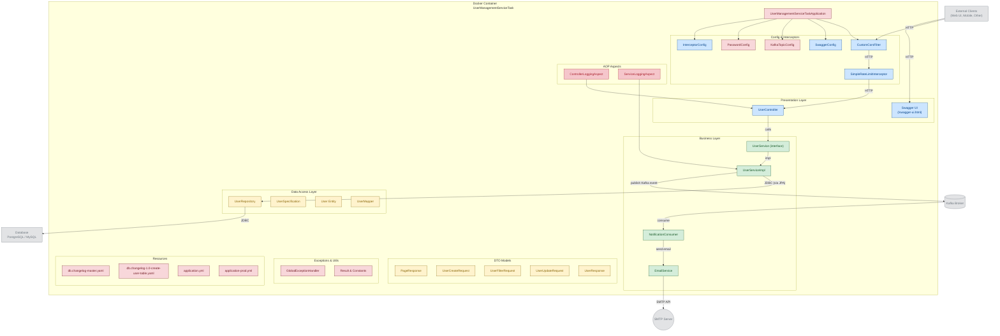

# User-Management-Service
# User-Management-Service - Core Architecture Diagram

```mermaid
flowchart TD
    %% External Clients
    Client["External Clients\n(Web UI, Mobile, Other)"]:::external

    %% Container Boundary
    subgraph "Docker Container\nUserManagementServiceTask" 
        direction TB

        %% Application Starter
        App["UserManagementServiceTaskApplication"]:::infra
        click App "https://github.com/mlbyl/user-management-service-task/blob/master/src/main/java/com/mlbyl/usermanagementservicetask/UserManagementServiceTaskApplication.java"

        %% Configurations
        subgraph "Config & Interceptors" 
            direction TB
            CORS["CustomCorsFilter"]:::presentation
            click CORS "https://github.com/mlbyl/user-management-service-task/blob/master/src/main/java/com/mlbyl/usermanagementservicetask/config/CustomCorsFilter.java"
            RateLimit["SimpleRateLimitInterceptor"]:::presentation
            click RateLimit "https://github.com/mlbyl/user-management-service-task/blob/master/src/main/java/com/mlbyl/usermanagementservicetask/config/SimpleRateLimitInterceptor.java"
            InterceptorCfg["InterceptorConfig"]:::presentation
            click InterceptorCfg "https://github.com/mlbyl/user-management-service-task/blob/master/src/main/java/com/mlbyl/usermanagementservicetask/config/InterceptorConfig.java"
            Swagger["SwaggerConfig"]:::presentation
            click Swagger "https://github.com/mlbyl/user-management-service-task/blob/master/src/main/java/com/mlbyl/usermanagementservicetask/config/SwaggerConfig.java"
            KafkaCfg["KafkaTopicConfig"]:::infra
            click KafkaCfg "https://github.com/mlbyl/user-management-service-task/blob/master/src/main/java/com/mlbyl/usermanagementservicetask/config/KafkaTopicConfig.java"
            PasswordCfg["PasswordConfig"]:::infra
            click PasswordCfg "https://github.com/mlbyl/user-management-service-task/blob/master/src/main/java/com/mlbyl/usermanagementservicetask/config/PasswordConfig.java"
        end

        %% AOP Aspects
        subgraph "AOP Aspects" 
            direction TB
            AopCtrl["ControllerLoggingAspect"]:::crosscut
            click AopCtrl "https://github.com/mlbyl/user-management-service-task/blob/master/src/main/java/com/mlbyl/usermanagementservicetask/AOP/ControllerLoggingAspect.java"
            AopSvc["ServiceLoggingAspect"]:::crosscut
            click AopSvc "https://github.com/mlbyl/user-management-service-task/blob/master/src/main/java/com/mlbyl/usermanagementservicetask/AOP/ServiceLoggingAspect.java"
        end

        %% API Layer
        subgraph "Presentation Layer" 
            direction TB
            Controller["UserController"]:::presentation
            click Controller "https://github.com/mlbyl/user-management-service-task/blob/master/src/main/java/com/mlbyl/usermanagementservicetask/controller/UserController.java"
            SwaggerUI["Swagger UI\n(/swagger-ui.html)"]:::presentation
        end

        %% Service Layer
        subgraph "Business Layer" 
            direction TB
            UserSvcIntf["UserService (interface)"]:::business
            click UserSvcIntf "https://github.com/mlbyl/user-management-service-task/blob/master/src/main/java/com/mlbyl/usermanagementservicetask/service/UserService.java"
            UserSvcImpl["UserServiceImpl"]:::business
            click UserSvcImpl "https://github.com/mlbyl/user-management-service-task/blob/master/src/main/java/com/mlbyl/usermanagementservicetask/service/UserServiceImpl.java"
            EmailSvc["EmailService"]:::business
            click EmailSvc "https://github.com/mlbyl/user-management-service-task/blob/master/src/main/java/com/mlbyl/usermanagementservicetask/service/EmailService.java"
            NotificationConsumer["NotificationConsumer"]:::business
            click NotificationConsumer "https://github.com/mlbyl/user-management-service-task/blob/master/src/main/java/com/mlbyl/usermanagementservicetask/service/NotificationConsumer.java"
        end

        %% Data Layer
        subgraph "Data Access Layer" 
            direction TB
            Repo["UserRepository"]:::data
            click Repo "https://github.com/mlbyl/user-management-service-task/blob/master/src/main/java/com/mlbyl/usermanagementservicetask/repository/UserRepository.java"
            Spec["UserSpecification"]:::data
            click Spec "https://github.com/mlbyl/user-management-service-task/blob/master/src/main/java/com/mlbyl/usermanagementservicetask/specification/UserSpecification.java"
            Entity["User Entity"]:::data
            click Entity "https://github.com/mlbyl/user-management-service-task/blob/master/src/main/java/com/mlbyl/usermanagementservicetask/entity/User.java"
            Mapper["UserMapper"]:::data
            click Mapper "https://github.com/mlbyl/user-management-service-task/blob/master/src/main/java/com/mlbyl/usermanagementservicetask/mapper/UserMapper.java"
        end

        %% DTOs
        subgraph "DTO Models" 
            direction TB
            DTO1["PageResponse"]:::data
            click DTO1 "https://github.com/mlbyl/user-management-service-task/blob/master/src/main/java/com/mlbyl/usermanagementservicetask/dto/PageResponse.java"
            DTO2["UserCreateRequest"]:::data
            click DTO2 "https://github.com/mlbyl/user-management-service-task/blob/master/src/main/java/com/mlbyl/usermanagementservicetask/dto/UserCreateRequest.java"
            DTO3["UserFilterRequest"]:::data
            click DTO3 "https://github.com/mlbyl/user-management-service-task/blob/master/src/main/java/com/mlbyl/usermanagementservicetask/dto/UserFilterRequest.java"
            DTO4["UserUpdateRequest"]:::data
            click DTO4 "https://github.com/mlbyl/user-management-service-task/blob/master/src/main/java/com/mlbyl/usermanagementservicetask/dto/UserUpdateRequest.java"
            DTO5["UserResponse"]:::data
            click DTO5 "https://github.com/mlbyl/user-management-service-task/blob/master/src/main/java/com/mlbyl/usermanagementservicetask/dto/UserResponse.java"
        end

        %% Exception & Utils
        subgraph "Exceptions & Utils" 
            direction TB
            ExHandler["GlobalExceptionHandler"]:::infra
            click ExHandler "https://github.com/mlbyl/user-management-service-task/blob/master/src/main/java/com/mlbyl/usermanagementservicetask/exception/GlobalExceptionHandler.java"
            ResultUtil["Result & Constants"]:::infra
            click ResultUtil "https://github.com/mlbyl/user-management-service-task/blob/master/src/main/java/com/mlbyl/usermanagementservicetask/utils/Result/Result.java"
        end

        %% Database Migrations & Config Files
        subgraph "Resources" 
            direction TB
            ChgMaster["db.changelog-master.yaml"]:::infra
            click ChgMaster "https://github.com/mlbyl/user-management-service-task/blob/master/src/main/resources/db/changelog/db.changelog-master.yaml"
            Chg1["db.changelog-1.0-create-user-table.yaml"]:::infra
            click Chg1 "https://github.com/mlbyl/user-management-service-task/blob/master/src/main/resources/db/changelog/db.changelog-1.0-create-user-table.yaml"
            AppYml["application.yml"]:::infra
            click AppYml "https://github.com/mlbyl/user-management-service-task/blob/master/src/main/resources/application.yml"
            AppProd["application-prod.yml"]:::infra
            click AppProd "https://github.com/mlbyl/user-management-service-task/blob/master/src/main/resources/application-prod.yml"
        end

    end

    %% External Systems
    Database[Database<br>PostgreSQL / MySQL]:::external
    Kafka[(Kafka Broker)]:::external
    SMTP((SMTP Server)):::external

    %% Relationships
    Client -->|HTTP| CORS -->|HTTP| RateLimit -->|HTTP| Controller
    Controller -->|"calls"| UserSvcIntf
    UserSvcIntf -->|"impl"| UserSvcImpl
    UserSvcImpl -->|"JDBC (via JPA)"| Repo
    Repo -->|JDBC| Database
    UserSvcImpl -->|"publish Kafka event"| Kafka
    Kafka -->|consume| NotificationConsumer -->|"send email"| EmailSvc -->|SMTP API| SMTP
    Client -->|HTTP| SwaggerUI

    %% AOP interceptions
    AopCtrl --> Controller
    AopSvc --> UserSvcImpl

    %% Configuration and startup
    App --> CORS
    App --> Swagger
    App --> KafkaCfg
    App --> PasswordCfg
    App --> InterceptorCfg

    %% Styles
    classDef presentation fill:#cce5ff,stroke:#004085,color:#004085
    classDef business fill:#d4edda,stroke:#155724,color:#155724
    classDef data fill:#fff3cd,stroke:#856404,color:#856404
    classDef external fill:#e2e3e5,stroke:#6c757d,color:#6c757d
    classDef infra fill:#f8d7da,stroke:#721c24,color:#721c24
    classDef crosscut fill:#f5c6cb,stroke:#a71d2a,color:#a71d2a
```
