# User Management Service - README

## Table of Contents
1. [Installation](#installation)
2. [Project Purpose and General Structure](#project-purpose-and-general-structure)
3. [Architecture and Technologies](#architecture-and-technologies)
4. [Database Management](#database-management)
5. [User Management Details](#user-management-details)
6. [Error Handling](#error-handling)
7. [Event-Driven Architecture](#event-driven-architecture)
8. [API Documentation](#api-documentation)

---

## Installation

### Prerequisites
To run this project, you need the following tools installed on your system:
- Docker and Docker Compose
- Git (to clone the project)

### Step-by-Step Installation

#### 1. Clone the Project
```bash
git clone <repository-url>
cd user-management-service
```

#### 2. Start Docker Containers
The project manages all dependencies through Docker. You can start all services with a single command:

```bash
docker-compose up -d
```

This command will start:
- **PostgreSQL**: Database service running on port 9999
- **Apache Kafka**: Message queue for event-driven communication (port 9092)
- **Zookeeper**: Coordination service for Kafka
- **MailHog**: Email testing tool for development environment (SMTP: 1025, Web UI: 8025)
- **Application**: Spring Boot application (port 8080)

#### 3. Check Service Status
```bash
docker-compose ps
```

Make sure all services are in "Up" status.

#### 4. Access the Application
- **API Endpoint**: http://localhost:8080
- **MailHog Web UI**: http://localhost:8025 (to view sent emails)
- **PostgreSQL**: localhost:9999 (user: postgres, password: 12345678)

#### 5. Monitor Logs
```bash
# To monitor logs of all services
docker-compose logs -f

# To monitor only application logs
docker-compose logs -f app
```

### Stopping and Cleaning Containers
```bash
# Stop containers
docker-compose down

# Clean containers and volumes (database data will be deleted!)
docker-compose down -v
```

---

## Project Purpose and General Structure

This project is a **user management system** that incorporates the fundamentals of modern microservice architecture. The main purpose of the project is to perform user registration, update, deletion, and query operations in a secure, scalable, and maintainable way.

### What Can Be Done?

#### User Operations
* **User Registration**: New users can be registered in the system
  * Each user is identified by a unique UUID
  * Email addresses must be unique
  * Phone numbers are also kept unique
  * Passwords are automatically hashed with BCrypt
  * By default, each user is assigned the `ROLE_USER` role

* **View User Information**: 
  * Single user query (ID-based)
  * Bulk listing with pagination support
  * Advanced filtering capabilities

* **User Update**: Existing user information can be updated
  * Uniqueness check is performed when email changes
  * Update time is automatically recorded

* **User Deletion**: Users can be completely removed from the system

---

## Architecture and Technologies

### Core Technologies
* **Java 21**: Programming language and runtime used in the project
* **Spring Boot 3.x**: Main framework
* **PostgreSQL 16**: Relational database
* **Liquibase**: Database migration management
* **Apache Kafka**: Event-driven messaging
* **Docker & Docker Compose**: Containerization and orchestration

### Layered Architecture

The project uses a layered architecture in accordance with classic Spring Boot best practices:

#### 1. Controller Layer
`UserController` defines the API endpoints exposed to the outside world. This layer:
- Receives HTTP requests
- Triggers request validation (with Bean Validation)
- Calls the Service layer
- Returns responses with the standard `Result<T>` wrapper
- Uses HTTP status codes compliant with REST principles (201 Created, 200 OK, etc.)

#### 2. Service Layer
`UserService` and its implementation `UserServiceImpl` are the center of business logic:
- **Validation Rules**: Email and phone uniqueness check
- **Encryption**: BCrypt hashing with PasswordEncoder
- **Event Publishing**: Sends `user-registered` event over Kafka
- **Transaction Management**: Uses Spring's declarative transaction management

An interesting detail: Kafka dependency is injected **optionally**:
```java
private final ObjectProvider<KafkaTemplate<String, String>> kafkaTemplate;
```

This way, if Kafka is not present (for example, if it's disabled in the prod environment), the application doesn't throw an error, it just doesn't send events. This supports the scenario where Kafka is disabled in `application-prod.yml`.

#### 3. Repository Layer
`UserRepository` is the data access layer:
- `JpaRepository`: For CRUD operations
- `JpaSpecificationExecutor`: For dynamic query creation
- Custom query methods: `existsByEmail`, `findByEmail`

#### 4. Specification Layer
`UserSpecification` creates dynamic and type-safe queries. Advantages of this pattern:
- **Compile-time safety**: Incorrect field names will give a compile error
- **Composability**: Multiple filters can be combined
- **Null safety**: Null values are automatically ignored

Example working logic:
```java
// Find users whose name contains AND surname contains
predicates.add(cb.like(cb.lower(root.get("name")), "%john%"));
predicates.add(cb.like(cb.lower(root.get("surname")), "%doe%"));
// Predicates are combined with AND
```

---

## Database Management

### Migration with Liquibase

The project manages database schema changes with **Liquibase**. Benefits of this approach:

1. **Version Control**: Every schema change is kept in git
2. **Rollback Support**: Erroneous migrations can be rolled back
3. **Environment Consistency**: Dev, test, prod have the same schema
4. **Audit Trail**: What changes were made when is recorded

Configuration:
```yaml
spring:
  jpa:
    hibernate:
      ddl-auto: none  # Prevent Hibernate from creating schema
  liquibase:
    enabled: true
    change-log: classpath:/db/changelog/db.changelog-master.yaml
```

`ddl-auto: none` is a very important detail. This disables Hibernate's automatic table creation and gives all control to Liquibase. This way:
- Schema changes are made in a controlled manner
- Tables don't accidentally drop in production
- Changes go through code review

### Entity Design

The `User` entity has a well-thought-out design:

```java
@Id
@GeneratedValue
private UUID id;  // UUID usage
```

**Why UUID?**
- No predictability risk of sequential IDs
- Minimal collision risk in distributed systems
- Client-side ID generation is possible
- Security: Even if ID is shown in URL, it cannot be enumerated

```java
@CreationTimestamp
private LocalDateTime createdAt;

@UpdateTimestamp
private LocalDateTime updatedAt;
```

**Audit Fields**: Automatically managed with Hibernate annotations. No need for manual setting.

```java
@Enumerated(EnumType.STRING)
private UserRole userRole;
```

**EnumType.STRING usage**: Stores string values like "ROLE_USER" in the database. If the alternative `EnumType.ORDINAL` (0, 1, 2...) were used:
- Changing the enum order would lead to data corruption
- Code readability would decrease
- Migration risks would increase

---

## User Management Details

### Registration Process

When a user registers, the following steps occur:

1. **Validation**: Request is automatically validated thanks to `@Valid` annotation
   - Name and surname cannot be empty
   - Email format check
   - Password must be between 8-64 characters
   - Phone number is checked with regex: `\+?[0-9]{7,15}`

2. **Business Validation**: 
   ```java
   checkEmailExist(request.getEmail());
   ```
   If email exists in the database, `BusinessException` is thrown (HTTP 409 Conflict)

3. **Password Encryption**:
   ```java
   String encodedPassword = passwordEncoder.encode(user.getPassword());
   ```
   BCrypt algorithm is used. A different salt is generated for each encode operation.

4. **Role Assignment**:
   ```java
   user.setUserRole(UserRole.ROLE_USER);
   ```
   Default role is assigned. Can be used for role-based access control in the future.

5. **Database Persist**: Saved to database within a transaction

6. **Event Publishing**:
   ```java
   kafkaTemplate.ifAvailable(kafka -> 
       kafka.send("user-registered", savedUser.getEmail())
   );
   ```
   If Kafka is available, event is sent asynchronously. This event can be listened to by other microservices (for example, a service that sends welcome emails).

### Filtering and Pagination

The user list endpoint offers a sophisticated filtering mechanism:

```java
PageResponse<UserResponse> getAll(UserFilterRequest filterRequest, int page, int size)
```

**Specification Pattern**: Dynamic queries are created. Example scenarios:

* **Users containing name**: `name=john` → `WHERE LOWER(name) LIKE '%john%'`
* **Born in date range**: `dateOfBirthFrom=1990-01-01&dateOfBirthTo=2000-12-31`
* **Combination**: Multiple filters are combined with AND

**Pagination**: Spring Data's `Pageable` mechanism is used:
- `page=0`: First page (0-indexed)
- `size=10`: 10 records per page
- Metadata is returned in response: `totalElements`, `totalPages`, `first`, `last`

### Update Logic

The update operation includes careful validation:

```java
if (!existUser.getEmail().equals(request.getEmail())) {
    checkEmailExist(request.getEmail());
}
```

**Logic**: If email hasn't changed, uniqueness check is unnecessary. If it has changed, it checks whether the new email is being used by someone else. This prevents unnecessary DB queries.

---

## Error Handling

The project uses an enterprise-grade error management strategy.

### Exception Hierarchy

```
BaseException (abstract)
├── NotFoundException (404)
├── BusinessException (409, 400, etc.)
├── ValidationException (400)
├── DatabaseException (409)
└── InternalServerErrorException (500)
```

Each exception has:
- `errorCode`: Programmatic error code (e.g.: `USER_NOT_FOUND`)
- `statusCode`: HTTP status code (e.g.: 404)
- `message`: Human-readable error message

### Global Exception Handler

Centralized error catching with `@RestControllerAdvice`:

```java
@ExceptionHandler(BaseException.class)
public ResponseEntity<Result<?>> handleBaseException(...)
```

**Advantages**:
- No try-catch clutter in controllers
- Consistent error response format
- Detailed logging (error type, message, path, status)

**Special Handlers**:

1. **DataIntegrityViolationException**: Database constraint violations (unique, foreign key, etc.)
   ```java
   exception.getMostSpecificCause().getMessage()
   ```
   Returns the most specific error (e.g.: "duplicate key value violates unique constraint")

2. **MethodArgumentNotValidException**: Bean Validation errors
   ```java
   List<String> errors = exception.getBindingResult().getFieldErrors()
       .stream()
       .map(error -> error.getField() + ": " + error.getDefaultMessage())
       .toList();
   ```
   All validation errors are returned as a list (e.g.: `["email: Email cannot be blank", "password: Password must be between 8 and 64 characters long"]`)

3. **Exception**: Catch-all handler. Catches unexpected errors and returns `500 Internal Server Error`.

### Result Wrapper Pattern

All API responses are wrapped with `Result<T>`:

```json
{
  "success": true,
  "message": "User created successfully",
  "data": { ... },
  // In case of error:
  "errorCode": "USER_NOT_FOUND",
  "statusCode": 404,
  "path": "/api/user/123"
}
```

**Benefits**:
- Clients always expect the same response structure
- Success/failure status is clearly indicated
- Error details are in standard format
- Null fields are not added to response with `@JsonInclude(JsonInclude.Include.NON_NULL)`

---

## Event-Driven Architecture

### Kafka Integration

The project establishes asynchronous event-driven communication with Kafka. However, this integration is **optional**:

```java
private final ObjectProvider<KafkaTemplate<String, String>> kafkaTemplate;

kafkaTemplate.ifAvailable(kafka -> kafka.send("user-registered", email));
```

**ObjectProvider Pattern**: Thanks to this pattern added in Spring 5.1:
- If Kafka is not present, the application starts
- If the bean is not found, the `ifAvailable` block doesn't run
- Kafka can be disabled in production (`application-prod.yml`)

### Event Flow

1. **User Registration**:
   ```
   POST /api/user → UserService.createUser() 
   → User saved to DB 
   → Event published to Kafka topic "user-registered"
   ```

2. **Kafka Consumer** (not in this project, could be in another service):
   ```
   Listen to "user-registered" 
   → Send welcome email via MailHog
   ```

### Email in Dev Environment

Using MailHog is very practical:
- **SMTP Server**: Runs on port 1025
- **Web UI**: All sent emails can be viewed at http://localhost:8025
- No real email sending, it's for testing purposes
- In production, real SMTP (SendGrid, AWS SES, etc.) is used

---

## API Documentation

### Main Endpoints

#### 1. Create User
```http
POST /api/user
Content-Type: application/json

{
  "name": "John",
  "surname": "Doe",
  "email": "john.doe@example.com",
  "password": "SecurePass123",
  "phoneNumber": "+1234567890",
  "dateOfBirth": "1990-01-15"
}
```

**Response (201 Created)**:
```json
{
  "success": true,
  "message": "User created successfully",
  "data": {
    "id": "550e8400-e29b-41d4-a716-446655440000",
    "name": "John",
    "surname": "Doe",
    "email": "john.doe@example.com",
    "phoneNumber": "+1234567890",
    "dateOfBirth": "1990-01-15",
    "userRole": "ROLE_USER"
  }
}
```

#### 2. Get User
```http
GET /api/user/{userId}
```

**Response (200 OK)**: Same as the data object above

#### 3. List Users
```http
GET /api/user?name=John&page=0&size=10
```

**Response (200 OK)**:
```json
{
  "success": true,
  "message": "All users retrieved successfully",
  "data": {
    "content": [ /* user objects */ ],
    "pageNumber": 0,
    "pageSize": 10,
    "totalElements": 25,
    "totalPages": 3,
    "first": true,
    "last": false
  }
}
```

#### 4. Update User
```http
PUT /api/user/{userId}
Content-Type: application/json

{
  "name": "John",
  "surname": "Smith",
  "email": "john.smith@example.com",
  "password": "NewSecurePass456",
  "phoneNumber": "+1234567890",
  "dateOfBirth": "1990-01-15"
}
```

#### 5. Delete User
```http
DELETE /api/user/{userId}
```

**Response (200 OK)**:
```json
{
  "success": true,
  "message": "User deleted successfully"
}
```

### Error Response Examples

**Validation Error (400 Bad Request)**:
```json
{
  "success": false,
  "message": "Validation error occurred",
  "data": [
    "email: Email cannot be blank",
    "password: Password must be between 8 and 64 characters long"
  ],
  "errorCode": "VALIDATION",
  "statusCode": 400,
  "path": "/api/user"
}
```

**User Not Found (404 Not Found)**:
```json
{
  "success": false,
  "message": "User not found with ID: 550e8400-e29b-41d4-a716-446655440000",
  "errorCode": "USER_NOT_FOUND",
  "statusCode": 404,
  "path": "/api/user/550e8400-e29b-41d4-a716-446655440000"
}
```

**Email Already Taken (409 Conflict)**:
```json
{
  "success": false,
  "message": "Email already taken",
  "errorCode": "USER_EXIST_EMAIL",
  "statusCode": 409,
  "path": "/api/user"
}
```

---

## Production Deployment Notes

### Environment Profiles

The project has two profiles:

1. **dev** (default): Local development with Docker Compose
   - All services run in containers
   - Kafka and MailHog are active
   - Debug logging is enabled

2. **prod**: For production deployment
   - Kafka is disabled (`exclude: KafkaAutoConfiguration`)
   - Database credentials come from environment variables
   - Logging is minimized (WARN level)

### Required Environment Variables (Prod)

```bash
DB_URL=jdbc:postgresql://prod-db-host:5432/dbname
DB_USER=prod_user
DB_PASS=secure_password
SWAGGER_SERVER_URL=https://your-domain.com
```

### Dockerfile Multi-Stage Build

```dockerfile
# Stage 1: Build
FROM eclipse-temurin:21-jdk AS builder
# ... gradle build operations

# Stage 2: Runtime
FROM eclipse-temurin:21-jre AS runtime
COPY --from=builder /app/build/libs/*.jar app.jar
```

**Benefits**:
- **Small Image**: Final image contains JRE, not JDK + build tools
- **Security**: Source code is not in the final image
- **Speed**: Build artifacts are cached

### Logging

In prod, logs are written to file:
```yaml
logging:
  file:
    name: logs/user-management.log
```

Volume mounted in Docker Compose:
```yaml
volumes:
  - ./logs:/app/logs
```

This way, logs are not lost even if the container restarts.

---

## Future Enhancements

This project is a basic user management system. Features that can be added in the future:

* **Authentication & Authorization**: JWT token-based security
* **Role-Based Access Control**: Admin, moderator, user roles
* **Email Verification**: Email verification after registration
* **Password Reset**: Password reset flow
* **Account Locking**: Account locking after failed login attempts
* **Audit Log**: Recording all user operations
* **Rate Limiting**: To prevent API abuse
* **Caching**: Caching frequent queries with Redis
* **API Gateway**: Routing and authentication in microservice architecture

---

This README explains all aspects of the project in detail. If you have any questions or topics you'd like to add, please let me know!

# User-Management-Service
# User-Management-Service - Core Architecture Diagram

```mermaid
flowchart TD
    %% External Clients
    Client["External Clients\n(Web UI, Mobile, Other)"]:::external

    %% Container Boundary
    subgraph "Docker Container\nUserManagementServiceTask" 
        direction TB

        %% Application Starter
        App["UserManagementServiceTaskApplication"]:::infra
        click App "https://github.com/mlbyl/user-management-service-task/blob/master/src/main/java/com/mlbyl/usermanagementservicetask/UserManagementServiceTaskApplication.java"

        %% Configurations
        subgraph "Config & Interceptors" 
            direction TB
            CORS["CustomCorsFilter"]:::presentation
            click CORS "https://github.com/mlbyl/user-management-service-task/blob/master/src/main/java/com/mlbyl/usermanagementservicetask/config/CustomCorsFilter.java"
            RateLimit["SimpleRateLimitInterceptor"]:::presentation
            click RateLimit "https://github.com/mlbyl/user-management-service-task/blob/master/src/main/java/com/mlbyl/usermanagementservicetask/config/SimpleRateLimitInterceptor.java"
            InterceptorCfg["InterceptorConfig"]:::presentation
            click InterceptorCfg "https://github.com/mlbyl/user-management-service-task/blob/master/src/main/java/com/mlbyl/usermanagementservicetask/config/InterceptorConfig.java"
            Swagger["SwaggerConfig"]:::presentation
            click Swagger "https://github.com/mlbyl/user-management-service-task/blob/master/src/main/java/com/mlbyl/usermanagementservicetask/config/SwaggerConfig.java"
            KafkaCfg["KafkaTopicConfig"]:::infra
            click KafkaCfg "https://github.com/mlbyl/user-management-service-task/blob/master/src/main/java/com/mlbyl/usermanagementservicetask/config/KafkaTopicConfig.java"
            PasswordCfg["PasswordConfig"]:::infra
            click PasswordCfg "https://github.com/mlbyl/user-management-service-task/blob/master/src/main/java/com/mlbyl/usermanagementservicetask/config/PasswordConfig.java"
        end

        %% AOP Aspects
        subgraph "AOP Aspects" 
            direction TB
            AopCtrl["ControllerLoggingAspect"]:::crosscut
            click AopCtrl "https://github.com/mlbyl/user-management-service-task/blob/master/src/main/java/com/mlbyl/usermanagementservicetask/AOP/ControllerLoggingAspect.java"
            AopSvc["ServiceLoggingAspect"]:::crosscut
            click AopSvc "https://github.com/mlbyl/user-management-service-task/blob/master/src/main/java/com/mlbyl/usermanagementservicetask/AOP/ServiceLoggingAspect.java"
        end

        %% API Layer
        subgraph "Presentation Layer" 
            direction TB
            Controller["UserController"]:::presentation
            click Controller "https://github.com/mlbyl/user-management-service-task/blob/master/src/main/java/com/mlbyl/usermanagementservicetask/controller/UserController.java"
            SwaggerUI["Swagger UI\n(/swagger-ui.html)"]:::presentation
        end

        %% Service Layer
        subgraph "Business Layer" 
            direction TB
            UserSvcIntf["UserService (interface)"]:::business
            click UserSvcIntf "https://github.com/mlbyl/user-management-service-task/blob/master/src/main/java/com/mlbyl/usermanagementservicetask/service/UserService.java"
            UserSvcImpl["UserServiceImpl"]:::business
            click UserSvcImpl "https://github.com/mlbyl/user-management-service-task/blob/master/src/main/java/com/mlbyl/usermanagementservicetask/service/UserServiceImpl.java"
            EmailSvc["EmailService"]:::business
            click EmailSvc "https://github.com/mlbyl/user-management-service-task/blob/master/src/main/java/com/mlbyl/usermanagementservicetask/service/EmailService.java"
            NotificationConsumer["NotificationConsumer"]:::business
            click NotificationConsumer "https://github.com/mlbyl/user-management-service-task/blob/master/src/main/java/com/mlbyl/usermanagementservicetask/service/NotificationConsumer.java"
        end

        %% Data Layer
        subgraph "Data Access Layer" 
            direction TB
            Repo["UserRepository"]:::data
            click Repo "https://github.com/mlbyl/user-management-service-task/blob/master/src/main/java/com/mlbyl/usermanagementservicetask/repository/UserRepository.java"
            Spec["UserSpecification"]:::data
            click Spec "https://github.com/mlbyl/user-management-service-task/blob/master/src/main/java/com/mlbyl/usermanagementservicetask/specification/UserSpecification.java"
            Entity["User Entity"]:::data
            click Entity "https://github.com/mlbyl/user-management-service-task/blob/master/src/main/java/com/mlbyl/usermanagementservicetask/entity/User.java"
            Mapper["UserMapper"]:::data
            click Mapper "https://github.com/mlbyl/user-management-service-task/blob/master/src/main/java/com/mlbyl/usermanagementservicetask/mapper/UserMapper.java"
        end

        %% DTOs
        subgraph "DTO Models" 
            direction TB
            DTO1["PageResponse"]:::data
            click DTO1 "https://github.com/mlbyl/user-management-service-task/blob/master/src/main/java/com/mlbyl/usermanagementservicetask/dto/PageResponse.java"
            DTO2["UserCreateRequest"]:::data
            click DTO2 "https://github.com/mlbyl/user-management-service-task/blob/master/src/main/java/com/mlbyl/usermanagementservicetask/dto/UserCreateRequest.java"
            DTO3["UserFilterRequest"]:::data
            click DTO3 "https://github.com/mlbyl/user-management-service-task/blob/master/src/main/java/com/mlbyl/usermanagementservicetask/dto/UserFilterRequest.java"
            DTO4["UserUpdateRequest"]:::data
            click DTO4 "https://github.com/mlbyl/user-management-service-task/blob/master/src/main/java/com/mlbyl/usermanagementservicetask/dto/UserUpdateRequest.java"
            DTO5["UserResponse"]:::data
            click DTO5 "https://github.com/mlbyl/user-management-service-task/blob/master/src/main/java/com/mlbyl/usermanagementservicetask/dto/UserResponse.java"
        end

        %% Exception & Utils
        subgraph "Exceptions & Utils" 
            direction TB
            ExHandler["GlobalExceptionHandler"]:::infra
            click ExHandler "https://github.com/mlbyl/user-management-service-task/blob/master/src/main/java/com/mlbyl/usermanagementservicetask/exception/GlobalExceptionHandler.java"
            ResultUtil["Result & Constants"]:::infra
            click ResultUtil "https://github.com/mlbyl/user-management-service-task/blob/master/src/main/java/com/mlbyl/usermanagementservicetask/utils/Result/Result.java"
        end

        %% Database Migrations & Config Files
        subgraph "Resources" 
            direction TB
            ChgMaster["db.changelog-master.yaml"]:::infra
            click ChgMaster "https://github.com/mlbyl/user-management-service-task/blob/master/src/main/resources/db/changelog/db.changelog-master.yaml"
            Chg1["db.changelog-1.0-create-user-table.yaml"]:::infra
            click Chg1 "https://github.com/mlbyl/user-management-service-task/blob/master/src/main/resources/db/changelog/db.changelog-1.0-create-user-table.yaml"
            AppYml["application.yml"]:::infra
            click AppYml "https://github.com/mlbyl/user-management-service-task/blob/master/src/main/resources/application.yml"
            AppProd["application-prod.yml"]:::infra
            click AppProd "https://github.com/mlbyl/user-management-service-task/blob/master/src/main/resources/application-prod.yml"
        end

    end

    %% External Systems
    Database[Database<br>PostgreSQL / MySQL]:::external
    Kafka[(Kafka Broker)]:::external
    SMTP((SMTP Server)):::external

    %% Relationships
    Client -->|HTTP| CORS -->|HTTP| RateLimit -->|HTTP| Controller
    Controller -->|"calls"| UserSvcIntf
    UserSvcIntf -->|"impl"| UserSvcImpl
    UserSvcImpl -->|"JDBC (via JPA)"| Repo
    Repo -->|JDBC| Database
    UserSvcImpl -->|"publish Kafka event"| Kafka
    Kafka -->|consume| NotificationConsumer -->|"send email"| EmailSvc -->|SMTP API| SMTP
    Client -->|HTTP| SwaggerUI

    %% AOP interceptions
    AopCtrl --> Controller
    AopSvc --> UserSvcImpl

    %% Configuration and startup
    App --> CORS
    App --> Swagger
    App --> KafkaCfg
    App --> PasswordCfg
    App --> InterceptorCfg

    %% Styles
    classDef presentation fill:#cce5ff,stroke:#004085,color:#004085
    classDef business fill:#d4edda,stroke:#155724,color:#155724
    classDef data fill:#fff3cd,stroke:#856404,color:#856404
    classDef external fill:#e2e3e5,stroke:#6c757d,color:#6c757d
    classDef infra fill:#f8d7da,stroke:#721c24,color:#721c24
    classDef crosscut fill:#f5c6cb,stroke:#a71d2a,color:#a71d2a
```


